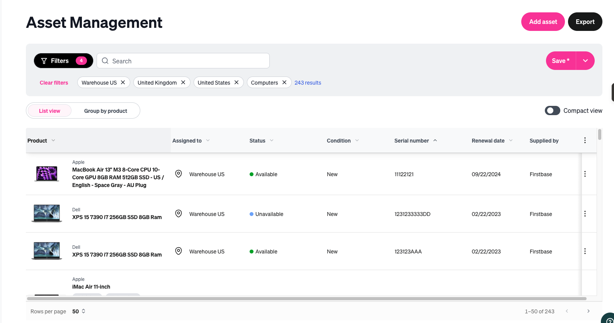
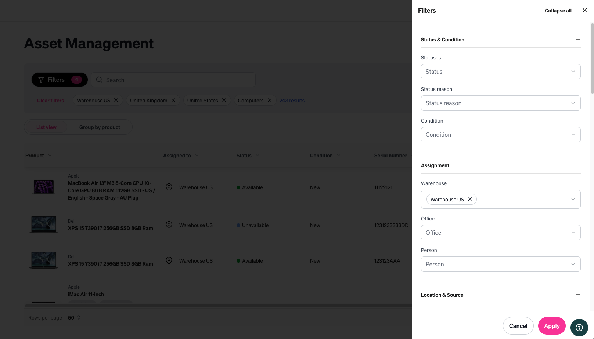

*(before)*

*(after)*

<iframe 
  width="100%" 
  height="400" 
  src="https://www.youtube.com/embed/QXzCT9l4rwo" 
  frameborder="0" 
  allow="accelerometer; autoplay; clipboard-write; encrypted-media; gyroscope; picture-in-picture" 
  allowfullscreen>
</iframe>

## Overview

Build customizable views with a twist – modern tables, new filter drawer, new design system – so that admins can manage their 100s or 1,000s of assets more efficiently and personally.

## Snapshot for project

- Role: Lead FE
- Team: Myself, staff backend engineer, designer and product director
- Stack: TypeScript, React, Tailwind, Shadcn
- Scope: Full-stack coordination

## Context

Post acquisition, we had breathing room to address major customer frustration in Asset Management (tables, exports, filtering, inventory reassignment). The core issue that surfaced through admin feedback was clear: **we lacked personalization**.

By default, tables rendered all columns, and filter/pagination choices weren’t persisted. Every return visit meant reapplying filters and wrestling with irrelevant data. Since this is the **primary** page admins live in, the impact was real—one of our largest customers explicitly raised **churn risk** due to the lack of saved views.

As we scaled, the pattern became obvious: we needed a durable personalization platform, not a one-off patch.

## Constraints and Tradeoffs

### Constraints
- **Design system alignment:** I was simultaneously leading a UI/design-system overhaul to align with our parent company. This feature had to ship **and** move the product toward the new design system.
- **Time:** We targeted delivery before quarter-end due to renewal dependencies.

### Trade-offs
- **Scalability first:** We invested a couple of extra sprints to lay foundation work, since this would be the first of many views adopting the new architecture (technical + visual).
- **Limited integration tests:** I prioritized unit tests and E2E coverage. Some integration scenarios (e.g., many table states like empty/partial data) were awkward to validate cleanly at the integration layer given the view’s state permutations.

## Our Approach

### Phases
- **Pre-work:** Audit what to rebuild for the new design system vs. reuse from existing UI.
- **Phase 1 — Building blocks:** Ship core components: filter drawer, date selectors, combobox, and new table foundations.
- **Phase 2 — Rebuild the view:** Recreate the existing experience with the new components (no personalization yet), keeping state management intentionally simple.
- **Phase 3 — Reusable state management:** Introduce a reusable **Zustand** store to support scalable, testable personalization.

### Testing Strategy
- **Unit tests:** Complex utilities + reusable components/blocks.
- **E2E smoke:** Page load + core navigation and happy paths.

Given time constraints and the investment in platform building blocks, I focused on testing the **store logic**, key utilities, and E2E stability.

### Rollout
- Feature-flagged rollout to top customers waiting on the feature.
- Iterate quickly from early feedback.
- Expand to all customers once stable.

## Implementation Highlights
- **Design system progress:** Established the new component set and patterns that became the standard for subsequent views.
- **Dependable state management:** Implemented a new Zustand store pattern optimized for testability of state transitions/actions.
- **Modern foundation:** Built on **shadcn/ui**, **react-table** (headless primitives), and **Zustand** to set a scalable direction.

## Artifacts

*(after)*

*(after)*

